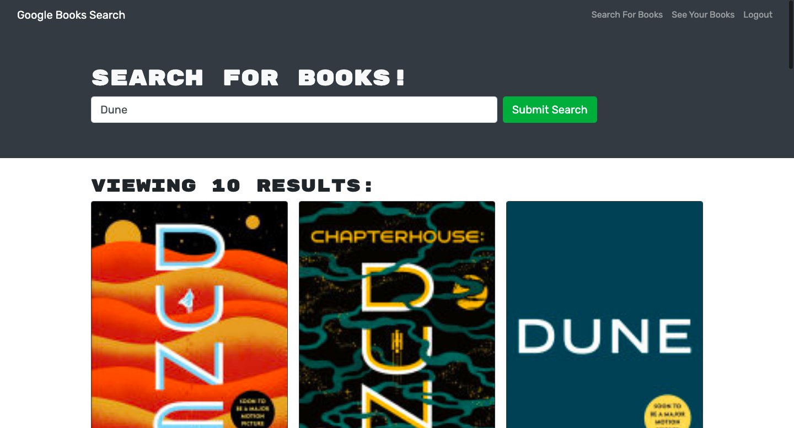

# 21. MERN Challenge: Book Search Engine

## Description

For this project I refactored an existing Google Book Search application. The application's back end was originally set up using a RESTFUL API, and  all of the routing was refactored to use GraphQL instead.

## Table of Contents

* [Usage](#usage)
* [Deployment](#deployment)
* [License](#license)
* [Credits](#credits)
* [Authors](#authors)
* [Questions](#questions)

## Usage

Create an account by clicking the "Login/Sign Up" link in the top right and use the search bar to search books using Google's books API. Save the books that interest you, and view them anytime by clicking "See Your Books".

## Deployment

The deployed application can be found at .

## License

[MIT](./LICENSE.txt)

## Credits

Technologies

* [Node.js](https://nodejs.org/en/)
* [React](https://reactjs.org/)
* [MongoDB](https://www.mongodb.com/)
* [GraphQL](https://graphql.org/)

NPM Dependencies

* [Express](https://www.npmjs.com/package/express)
* [bcrypt](https://www.npmjs.com/package/bcrypt)
* [jsonwebtoken](https://www.npmjs.com/package/jsonwebtoken)
* [@apollo/client](https://www.npmjs.com/package/@apollo/client)

## Authors

Aidan Amato

## Questions

Please reach out if you have any additional questions!

* [GitHub](https://github.com/aidanamato)
* [Email](mailto:aidanamato@comcast.net)